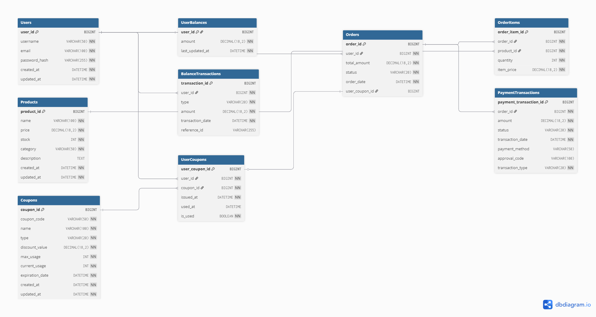

# [E-Commerce 시스템]

## 프로젝트 소개

이 프로젝트는 서버구축을 위한 설계 작업을 위한 프로젝트 입니다.

## 주요 기능

* 사용자 및 잔액 관리
* 상품 관리
* 쿠폰 관리
* 주문 및 결제

## 시스템 아키텍처 및 설계

### ERD (Entity-Relationship Diagram)

### 클래스 다이어그램

**사용자 잔액 관리:**

**상품 관리:**

**쿠폰 관리:**

**주문/결제:**

### 시퀀스 다이어그램

핵심 비즈니스 흐름에 대한 시퀀스 다이어그램입니다.

**주문/결제 시퀀스:**

**선착순 쿠폰 발급 시퀀스:**

**잔액 충전 시퀀스:** 

**상품 조회 시퀀스:**

